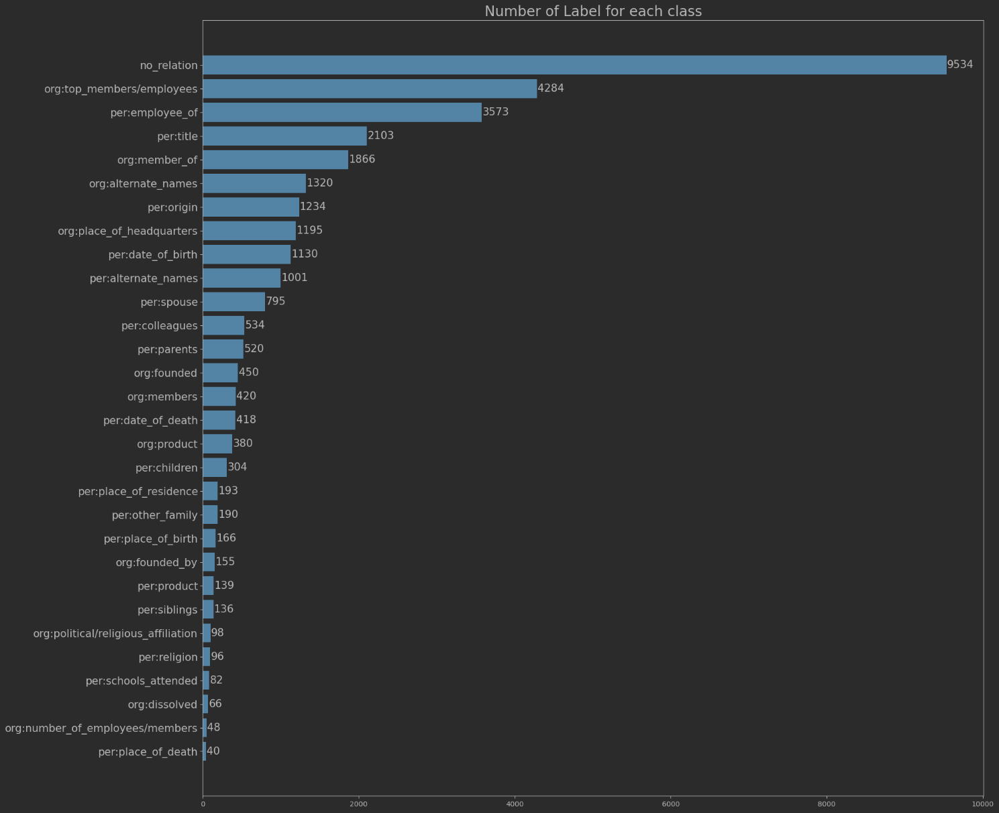

- [데이터 분석(EDA)](#데이터-분석eda)
  - [1. Class별 문장 길이 분포](#1-class별-문장-길이-분포)
  - [2. Unique Sentence의 갯수](#2-unique-sentence의-갯수)
  - [3. Class별 Data 갯수 분포](#3-class별-data-갯수-분포)
  - [4. 데이터 분석을 통해 고려해야할 것](#4-데이터-분석을-통해-고려해야할-것)

# 데이터 분석(EDA)
## 1. Class별 문장 길이 분포
{: .mx-auto.d-block:}
- 각 관계 Class별 문장 길이 분포에서는, 대부분의 문장이 300자 이내로 작성되어 있고, 소수의 문장이 400자 근처의 길이를 가지고 있었다.
- 문장 길이에선, 분포차이가 심하게 나지 않아서 신경쓸 부분이 없을 것 같아 보였다.

## 2. Unique Sentence의 갯수
- Train Dataset에서 전체 Sentence의 갯수는 32,470개이다.
  - 그중 Unique Sentence의 수는 28,803개이다.
  - 모든 데이터가 다른 Sentence를 가지고 있는 것은 아니였다.
- 또한 Subject Entity, Object Entity, Sentence가 모두 동일한 중복데이터도 93개 존재하였고, Label만 다른 데이터도 존재했다.
  - 기존 데이터의 일관성이 부족한 것으로 생각된다.
  - 하지만 아주 소수임으로 학습에 큰 문제가 될 것으로 보이진 않는다.

## 3. Class별 Data 갯수 분포
{: .mx-auto.d-block:}
- `no-relation`(Negative-Class)라벨의 갯수가 너무 많다.
- 대부분의 라벨들의 갯수가 1천개를 넘기지 못했다.
- 가장 적은 6개의 라벨의 갯수는 100개도 넘지 못했다.

## 4. 데이터 분석을 통해 고려해야할 것
- 라벨의 대부분이 Negative-Class이기에 일반화 성능이 잘 나올지 모르겠다.
- 소수의 Class들은 Train Data에 대해 과적합 될 위험이 있다.